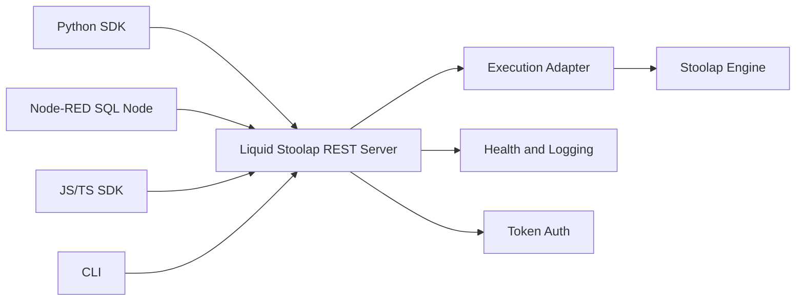
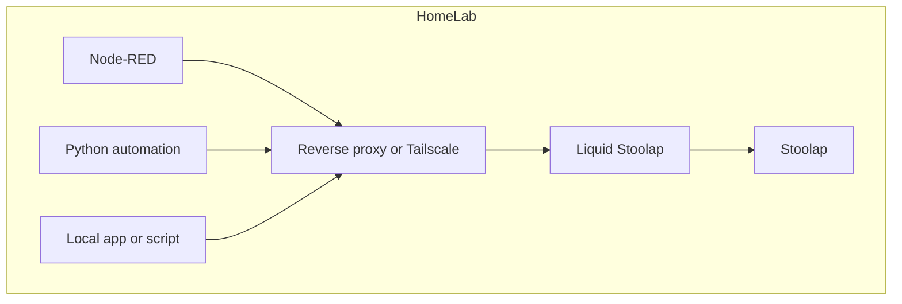
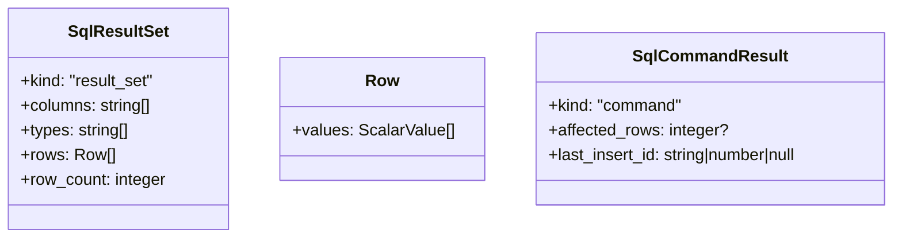
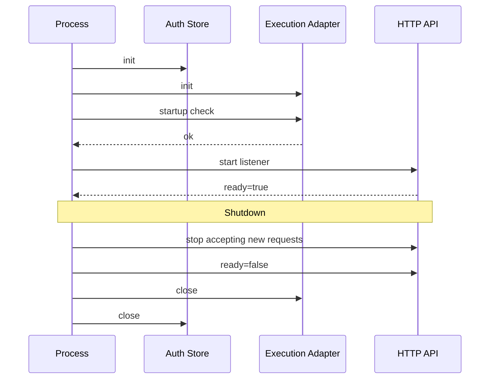
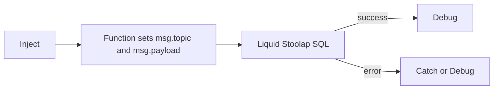
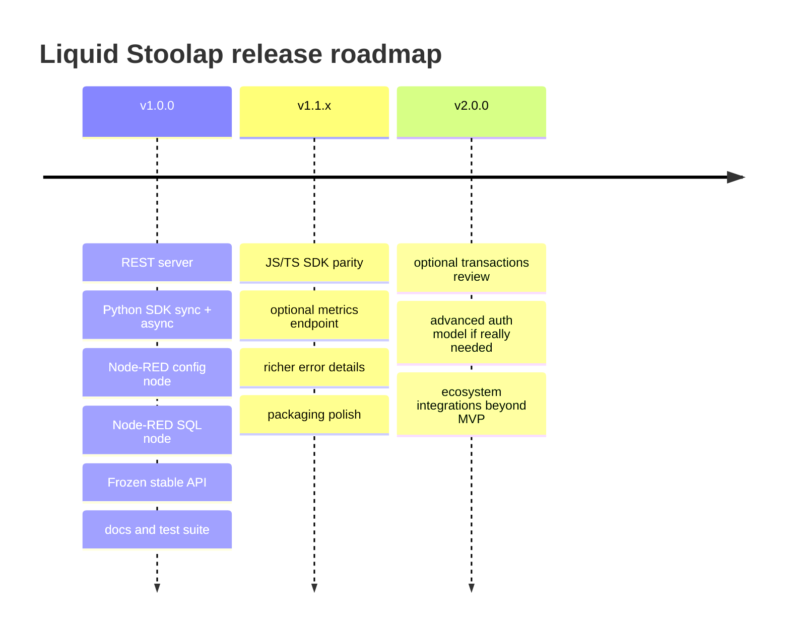

# Software Requirements Specification для Liquid Stoolap

## Исполнительное резюме и введение

### Исполнительное резюме

**Liquid Stoolap** — это лёгкий HTTP-сервер и набор официальных клиентских интеграций, предназначенных для безопасного и предсказуемого выполнения SQL-запросов к движку Stoolap из внешних систем автоматизации, скриптов и приложений. Серверная часть Liquid Stoolap должна быть реализована на **Free Pascal**; Python в проекте используется для официального Python SDK и тестовых/клиентских сценариев, но не как runtime HTTP-сервера. Основа продукта — минималистичный REST API, вокруг которого строятся официальный Python SDK, официальный Node-RED connector и, как часть экосистемы, официальный JavaScript/TypeScript SDK. Проект ориентирован на домашнюю автоматизацию, edge/IoT-сценарии и локальные self-hosted-развёртывания, где особенно важны простота сопровождения, стабильность API и минимальная операционная сложность. Нормативной базой для HTTP-части выступают общие семантики HTTP, bearer-аутентификация и общепринятые практики JSON Schema, а для клиентских интеграций — официальные рекомендации Node-RED, Python typing и HTTPX. citeturn7view6turn7view4turn7view7turn7view2turn9view1turn8view3

Настоящий документ фиксирует решения, согласованные в ходе проектирования, и оформляет их как единый связный **SRS**, пригодный для размещения в репозитории как `docs/SRS.md`. Документ является **нормативным**: реализация должна следовать спецификации, а не наоборот. До начала реализации API первой версии считается **замороженным**; изменения возможны только через ревизию спецификации и осознанное изменение версии. Это согласуется с практикой строгой контрактной стабилизации API и минимизации обратной несовместимости после 1.0. citeturn7view7turn7view6

В состав **MVP v1.0.0** входят три обязательных поставляемых компонента:  
**сервер Liquid Stoolap**, **официальный Python SDK** и **официальный Node-RED connector**. Дополнительно документ признаёт официальным направлением экосистемы **JS/TS SDK**, но его место в критериях готовности 1.0 отдельно вынесено в раздел открытых вопросов, потому что в проектных решениях одновременно присутствуют два сигнала: признание JS/TS как официального SDK и отдельная фиксация MVP как «server + Python SDK + Node-RED». Это противоречие не критично для архитектуры, но важно для release planning. 

### Введение

Цель Liquid Stoolap — дать **очень узкий, стабильный и понятный интерфейс** для удалённого выполнения SQL и получения результатов в JSON-формате. В отличие от полноценных ORM, BI-платформ или сложных брокеров данных, продукт умышленно не пытается стать универсальным дата-слоем. Он выступает как **тонкая HTTP-обёртка над Stoolap**, с минимальным набором административных и клиентских функций: выполнение SQL, получение токена, проверка здоровья сервиса, клиентские библиотеки и интеграция с Node-RED. Такая декомпозиция соответствует хорошей инженерной практике: границы сервиса остаются ясными, API — небольшим, а операционная поверхность — контролируемой. HTTP как статeless-протокол особенно хорошо подходит для такого контрактного интерфейса. citeturn7view6turn7view4

Целевая аудитория документа:

- разработчики сервера;
- сопровождающие Python SDK и Node-RED connector;
- инженеры автоматизации и self-hosted-операторы;
- reviewers и будущие maintainers репозитория.

Термины, используемые в документе:

| Термин | Значение |
|---|---|
| **Stoolap** | SQL-движок/хранилище, для которого Liquid Stoolap предоставляет HTTP-доступ |
| **Server** | HTTP-сервис Liquid Stoolap |
| **Free Pascal Server** | нормативная реализация HTTP-сервера Liquid Stoolap на Free Pascal |
| **SDK** | официальная клиентская библиотека |
| **Node-RED connector** | npm-пакет с configuration node и SQL node |
| **Result set** | результат SQL-запроса с колонками, массивом типов и строками |
| **BLOB** | бинарное значение, сериализуемое в обычную Base64-строку |
| **types array** | массив типов столбцов, по которому клиент интерпретирует значения |

Документ опирается на два класса источников. **Первичный источник истины** — согласованные проектные решения. **Вторичный источник** — общепринятые практики и нормативные документы для HTTP, bearer-аутентификации, JSON Schema, Python typing, HTTPX, Node-RED и CI/CD. Bearer-токены по стандарту должны защищаться при передаче и хранении; Node-RED рекомендует config nodes для общих соединений и credentials для скрываемых секретов; Python-экосистема рекомендует inline type annotations и PEP 561-совместимую упаковку для библиотек; HTTPX специально предоставляет как sync, так и async API и рекомендует долгоживущие client instances для повторного использования соединений. citeturn7view4turn8view4turn7view10turn8view3turn7view8turn9view0turn7view3

## Архитектурные принципы и архитектура системы

### Архитектурные принципы

Архитектура Liquid Stoolap строится вокруг следующих принципов.

**Минимализм важнее универсальности.** Сервер должен решать одну задачу: безопасно принимать SQL по HTTP, исполнять его через Stoolap и возвращать результат предсказуемым JSON-контрактом. Это означает сознательный отказ от тяжёлых надстроек: ORM-слоя, stateful database sessions, долгих мастеров настройки, сложных миграционных подсистем, GUI-админок и «магии» поверх SQL.

**Серверный runtime — Free Pascal.** HTTP-сервер, конфигурация, lifecycle, auth, execution adapter, CLI-команды, логирование и интеграция со Stoolap в v1 должны реализовываться в Free Pascal. Python-сервер, FastAPI/ASGI/Uvicorn и аналогичные Python HTTP stacks не являются допустимой серверной реализацией для MVP. Python остаётся официальным языком клиентского SDK и может использоваться в тестах только как внешний клиент.

**API — это центральный контракт проекта.** Все внешние компоненты — Python SDK, Node-RED, CLI, будущий JS/TS SDK — обязаны рассматриваться как производные от REST API. Такой подход соответствует общему правилу для статeless HTTP-сервисов: контракт должен быть устойчивым, а надстройки не должны выходить за пределы серверной семантики. citeturn7view6turn7view7

**Простая сериализация SQL-результатов важнее “красивого” JSON.** Принято решение представлять табличные данные в виде:
- массива `columns`;
- массива `types`;
- массива строк `rows`, где каждая строка содержит массив `values`.

Это решение даёт несколько преимуществ. Во-первых, формат стабилен и не теряет порядок столбцов. Во-вторых, клиенту не нужно гадать, что делать с бинарными значениями. В-третьих, JSON остаётся компактным и однородным, а семантика значений выносится в `types`, что хорошо сочетается с подходом JSON Schema к явному описанию структуры и ограничений документа. citeturn7view7turn1search14

**BLOB сериализуется как обычная Base64-строка**, а не как специальный JSON-объект. Интерпретация осуществляется исключительно на основании `types`. Такой выбор согласуется с тем, что Base64 является стандартным текстовым представлением бинарных данных, а JSON не имеет встроенного бинарного типа. citeturn7view5

**Безопасность должна быть скучной и предсказуемой.** Модель аутентификации в v1 — token-based. Токены передаются только в HTTP-заголовке `Authorization: Bearer ...`. Использование query-parameter или form-body для передачи токена запрещается в контракте сервера. Bearer-схема по стандарту требует защиты токена от раскрытия и предписывает TLS для передачи; в реальных развёртываниях это означает либо встроенный HTTPS, либо reverse proxy/Tailscale/VPN перед сервисом. citeturn10view0turn7view4

**Стабильность после 1.0 важнее скорости изменения.** До начала реализации API фиксируется; после релиза 1.0 несовместимые изменения допустимы только в новой major-версии. Данный SRS служит «конституцией проекта»: архитектурные и контрактные вопросы считаются закрытыми, если не вынесены в раздел открытых вопросов.

### Архитектура системы

На логическом уровне система состоит из четырёх слоёв:

1. **HTTP Server** — принимает запросы, валидирует JSON, аутентифицирует клиента, применяет лимиты и вызывает движок.
2. **Execution Adapter** — тонкий слой интеграции со Stoolap.
3. **Official Clients** — Python SDK, Node-RED connector, в экосистеме также JS/TS SDK.
4. **Operational Layer** — конфигурация, логирование, health check, CI/CD и release-процессы.



С точки зрения реализации сервер проектируется как **Free Pascal HTTP-приложение** с явным управлением конфигурацией, lifecycle, ресурсами Stoolap и сериализацией JSON. С точки зрения состояния сервер остаётся **stateless HTTP-приложением**: все данные, необходимые для обработки запроса, должны приходить в запросе или однозначно извлекаться из серверной конфигурации. Отсутствие прикладной пользовательской сессии упрощает масштабирование, перезапуск и поведение в случае ошибок, а также соответствует базовой архитектуре HTTP. citeturn7view6

С точки зрения развёртывания сервер предназначен прежде всего для локальных и edge-сценариев:



Такая схема отвечает типовым практикам self-hosted-эксплуатации. В production-подобной установке внешний доступ к bearer-токенам должен быть защищён транспортным шифрованием; если сервер выставляется наружу, reverse proxy с TLS становится обязательным практическим требованием. citeturn7view4

**Транзакционная модель v1.** Настоящая редакция SRS фиксирует следующий минималистичный контракт:
- один запрос `POST /sql` соответствует **одной единице исполнения**;
- сервер **не поддерживает stateful-серверные SQL-сессии**;
- многозапросные клиентские транзакции через отдельные HTTP-запросы в v1 не поддерживаются;
- многооператорные SQL-скрипты считаются **вне рамок v1** и по умолчанию должны отклоняться как `422 Unprocessable Content`, если не предусмотрен явный backend-режим с документированной безопасностью.

Это решение не было отдельно формализовано в переписке, поэтому оно дополнительно перечислено в конце как архитектурная фиксация текущей редакции SRS. Главная причина выбора — удержать API small-and-safe.

**Формат результата SQL** нормируется следующим образом:



Нормативные правила сериализации:

- `TEXT` сериализуется как JSON `string`;
- `INTEGER` и совместимые численные типы — как JSON `number`;
- `NULL` — как JSON `null`;
- `BOOLEAN`, если тип поддерживается Stoolap, — как JSON `boolean`;
- **`BLOB` — как Base64-строка**, без special wrapper-объекта;
- тип столбца определяется элементом массива `types`, выровненным по индексу с `columns` и `row.values`.

## Спецификация интерфейсов и эксплуатации

### REST API

#### Общие положения

Сервер должен использовать HTTP/1.1 или HTTP/2 поверх стандартной HTTP-семантики. Основные client/server-ошибки кодируются стандартными status codes, а тело ответа в ошибочных сценариях обязано содержать структурированное описание проблемы. HTTP по определению stateless; это хорошо соответствует модели «один запрос — одна операция исполнения SQL». citeturn7view6turn11view0turn11view1turn11view3

**Базовые правила API v1:**

- базовый media type: `application/json; charset=utf-8`;
- все write- или query-endpoints, кроме `/health`, используют JSON body;
- аутентификация — через заголовок `Authorization: Bearer <token>`;
- сервер возвращает JSON и по возможности не отдаёт HTML-ошибки;
- поле `request_id` присутствует в каждом ответе сервера;
- сервер может принимать `X-Request-Id` и, если он валиден, эхо-возвращать его в ответе.

**Рекомендуемые URL первой версии:**

| Метод | Путь | Назначение | Auth |
|---|---|---|---|
| `POST` | `/sql` | выполнить SQL-запрос | требуется |
| `POST` | `/auth/token` | получить bearer-токен | не требуется |
| `GET` | `/health` | проверить готовность сервиса | не требуется по умолчанию |

Дополнительные endpoint’ы в v1 не требуются. Это намеренное решение ради минимальной поверхности API.

#### Endpoint `/sql`

`POST /sql` — основной рабочий endpoint системы.

**Запрос**

```json
{
  "sql": "SELECT id, name, photo FROM users WHERE id = :id",
  "params": {
    "id": 42
  },
  "timeout_ms": 5000
}
```

**Семантика полей запроса:**

| Поле | Тип | Обязательность | Описание |
|---|---|---|---|
| `sql` | `string` | обязательно | SQL-текст запроса |
| `params` | `object` | опционально | именованные параметры |
| `timeout_ms` | `integer` | опционально | клиентский запрос на timeout, ограниченный серверным максимумом |

**Нормативные требования:**
- `sql` не может быть пустой строкой после тримминга;
- `params` должен быть JSON-объектом, а не массивом;
- значения параметров допускают `null`, `boolean`, `number`, `string`;
- бинарные параметры в v1 передаются строками Base64 только если это документировано клиентом и движок ожидает такую десериализацию;
- сервер может применять верхнюю границу `max_sql_timeout_ms`, независимо от значения клиента;
- сервер по умолчанию обрабатывает один SQL statement на запрос.

**Успешный ответ с result set**

```json
{
  "ok": true,
  "request_id": "f91c6d1a-8a91-4d0c-a0df-5d0b52f7f915",
  "duration_ms": 7,
  "result": {
    "kind": "result_set",
    "columns": ["id", "name", "photo"],
    "types": ["INTEGER", "TEXT", "BLOB"],
    "rows": [
      {
        "values": [42, "Ilya", "iVBORw0KGgoAAAANSUhEUgAA..."]
      }
    ],
    "row_count": 1
  }
}
```

BLOB в примере сериализован в обычную Base64-строку; механизм определения бинарности — массив `types`. Base64 является стандартным текстовым кодированием для бинарных данных. citeturn7view5

**Успешный ответ для командного запроса**

```json
{
  "ok": true,
  "request_id": "9bb1c5e5-9c92-4983-8e24-0d59c1ce6af1",
  "duration_ms": 12,
  "result": {
    "kind": "command",
    "affected_rows": 3,
    "last_insert_id": null
  }
}
```

**Ошибочный ответ**

```json
{
  "ok": false,
  "request_id": "3f9a9491-cc3f-4a42-8a87-4e2fe35bfb89",
  "error": {
    "code": "sql_error",
    "category": "sql",
    "message": "syntax error near FROMM",
    "retryable": false,
    "details": {
      "statement": "SELECT * FROMM users"
    }
  }
}
```

**Коды статуса для `/sql`:**

| Код | Когда используется | Основание |
|---|---|---|
| `200 OK` | запрос выполнен, есть корректный `result` | стандартный успешный ответ |
| `400 Bad Request` | некорректный JSON, отсутствует обязательное поле, неправильный тип поля | 400 означает клиентскую ошибку запроса citeturn11view0 |
| `401 Unauthorized` | отсутствует или недействителен bearer-токен | 401 означает отсутствие валидных учётных данных; должен присутствовать `WWW-Authenticate` citeturn11view1turn10view1 |
| `403 Forbidden` | токен валиден, но прав недостаточно | 403 означает, что сервер понял запрос, но отказывается его выполнять citeturn11view2turn10view3 |
| `422 Unprocessable Content` | JSON синтаксически корректен, но семантически неприемлем: пустой SQL, multi-statement, некорректная комбинация параметров | 422 применяется именно для корректного по синтаксису, но непроцессируемого содержимого citeturn11view5 |
| `500 Internal Server Error` | внутренняя ошибка сервера | 500 означает неожиданное условие на стороне сервера citeturn11view3 |
| `503 Service Unavailable` | сервис временно не готов: startup, backend недоступен, maintenance | 503 применим при временной перегрузке или недоступности сервиса citeturn11view4 |
| `504 Gateway Timeout` | сервер не дождался своевременного ответа от backend-слоя Stoolap | 504 применим, когда gateway/proxy не получил своевременный ответ upstream-сервиса citeturn12view0 |

**Пример HTTP-запроса**

```http
POST /sql HTTP/1.1
Host: localhost:8321
Content-Type: application/json
Authorization: Bearer eyJ...
X-Request-Id: req-123

{
  "sql": "SELECT id, payload FROM events WHERE id = :id",
  "params": {"id": 1},
  "timeout_ms": 3000
}
```

#### Endpoint `/auth/token`

`POST /auth/token` выдаёт bearer-токен для последующего доступа к защищённым endpoint’ам.

**Запрос**

```json
{
  "username": "admin",
  "password": "secret"
}
```

**Успешный ответ**

```json
{
  "ok": true,
  "request_id": "ffdb8bba-a66d-4501-96db-2c5a39f6d862",
  "token": {
    "access_token": "lst_2M8YQ8nT6n...",
    "token_type": "Bearer",
    "expires_in": 3600
  }
}
```

Bearer-аутентификация стандартизована RFC 6750. Клиент должен передавать токен в заголовке `Authorization`, а при ошибке сервер должен возвращать challenge через `WWW-Authenticate`. RFC 6750 также прямо указывает, что bearer-токены должны быть защищены в хранении и передаче, а TLS обязателен для реализации и использования этой схемы. citeturn10view0turn10view1turn7view4

**Особенности v1:**
- token refresh в v1 отсутствует;
- revoke endpoint в v1 отсутствует;
- сервер может инвалидировать все **ephemeral tokens** при перезапуске;
- допускается наличие **static tokens**, определённых в конфигурации, для сервисных клиентов и Node-RED.

**Ошибки `/auth/token`:**

| Код | Когда используется |
|---|---|
| `200 OK` | токен выдан |
| `400 Bad Request` | некорректный JSON, отсутствует `username`/`password` |
| `401 Unauthorized` | неверные credentials |
| `403 Forbidden` | auth-подсистема запрещает issue token из данного режима |
| `503 Service Unavailable` | auth-store не готов |

Если credentials отсутствуют или недействительны, 401 должен сопровождаться корректным challenge/описанием, совместимым с bearer-практикой. RFC 6750 определяет `invalid_request`, `invalid_token` и `insufficient_scope` как стандартные коды ошибок bearer-схемы. citeturn10view1turn10view2turn10view3

#### Endpoint `/health`

`GET /health` предоставляет информацию о готовности сервиса.

**Успешный ответ**

```json
{
  "ok": true,
  "status": "ok",
  "version": "1.0.0",
  "uptime_s": 1240,
  "ready": true,
  "auth_enabled": true
}
```

**Неготовый ответ**

```json
{
  "ok": false,
  "status": "degraded",
  "version": "1.0.0",
  "uptime_s": 4,
  "ready": false,
  "reason": "stoolap_unavailable"
}
```

**Контракт `/health` в v1:**
- endpoint не требует аутентификации по умолчанию;
- при `ready = true` сервер возвращает `200 OK`;
- при `ready = false` сервер возвращает `503 Service Unavailable`;
- проверка здоровья включает минимум:
  - процесс сервера жив;
  - конфигурация загружена;
  - execution adapter и backend Stoolap доступны для выполнения запроса.

Практика разделять liveness/readiness хорошо известна в оркестраторах; Kubernetes прямо различает эти виды probes. В минималистичном API v1 они схлопываются в один endpoint `/health`, потому что продукт сознательно держит маленькую поверхность API. citeturn7view11turn4search5

#### JSON Schema основных объектов

Ниже приведены нормализованные схемы уровня API. Они не обязаны совпадать с внутренним кодом один-в-один, но должны совпадать с wire-format’ом. В качестве спецификационной базы используется JSON Schema 2020-12. citeturn7view7

**`SqlRequest`**

```json
{
  "$schema": "https://json-schema.org/draft/2020-12/schema",
  "$id": "https://liquidstoolap.local/schema/sql-request.json",
  "title": "SqlRequest",
  "type": "object",
  "required": ["sql"],
  "additionalProperties": false,
  "properties": {
    "sql": {
      "type": "string",
      "minLength": 1
    },
    "params": {
      "type": "object",
      "additionalProperties": {
        "type": ["string", "number", "boolean", "null"]
      }
    },
    "timeout_ms": {
      "type": "integer",
      "minimum": 1
    }
  }
}
```

**`Row`**

```json
{
  "$schema": "https://json-schema.org/draft/2020-12/schema",
  "$id": "https://liquidstoolap.local/schema/row.json",
  "title": "Row",
  "type": "object",
  "required": ["values"],
  "additionalProperties": false,
  "properties": {
    "values": {
      "type": "array",
      "items": {
        "type": ["string", "number", "boolean", "null"]
      }
    }
  }
}
```

**`SqlResultSet`**

```json
{
  "$schema": "https://json-schema.org/draft/2020-12/schema",
  "$id": "https://liquidstoolap.local/schema/sql-result-set.json",
  "title": "SqlResultSet",
  "type": "object",
  "required": ["kind", "columns", "types", "rows", "row_count"],
  "additionalProperties": false,
  "properties": {
    "kind": {
      "const": "result_set"
    },
    "columns": {
      "type": "array",
      "items": { "type": "string" }
    },
    "types": {
      "type": "array",
      "items": { "type": "string" }
    },
    "rows": {
      "type": "array",
      "items": { "$ref": "row.json" }
    },
    "row_count": {
      "type": "integer",
      "minimum": 0
    }
  }
}
```

**`SqlCommandResult`**

```json
{
  "$schema": "https://json-schema.org/draft/2020-12/schema",
  "$id": "https://liquidstoolap.local/schema/sql-command-result.json",
  "title": "SqlCommandResult",
  "type": "object",
  "required": ["kind"],
  "additionalProperties": false,
  "properties": {
    "kind": {
      "const": "command"
    },
    "affected_rows": {
      "type": "integer",
      "minimum": 0
    },
    "last_insert_id": {
      "type": ["string", "number", "null"]
    }
  }
}
```

**`ErrorResponse`**

```json
{
  "$schema": "https://json-schema.org/draft/2020-12/schema",
  "$id": "https://liquidstoolap.local/schema/error-response.json",
  "title": "ErrorResponse",
  "type": "object",
  "required": ["ok", "request_id", "error"],
  "additionalProperties": false,
  "properties": {
    "ok": {
      "const": false
    },
    "request_id": {
      "type": "string"
    },
    "error": {
      "type": "object",
      "required": ["code", "category", "message", "retryable"],
      "additionalProperties": true,
      "properties": {
        "code": { "type": "string" },
        "category": { "type": "string" },
        "message": { "type": "string" },
        "retryable": { "type": "boolean" },
        "details": { "type": "object" }
      }
    }
  }
}
```

#### Канонический каталог кодов ошибок

Сервер должен стабилизировать значения `error.code`, потому that SDK и Node-RED будут ориентироваться именно на них, не на свободный текст `message`.

| `error.code` | `category` | HTTP | Описание |
|---|---|---|---|
| `invalid_json` | `request` | 400 | тело запроса не является валидным JSON |
| `invalid_request` | `request` | 400 | отсутствует обязательное поле/неверный тип |
| `invalid_sql` | `request` | 422 | SQL пустой или не прошёл базовые проверки |
| `multi_statement_not_allowed` | `request` | 422 | в запросе обнаружено более одного statement |
| `invalid_token` | `auth` | 401 | токен отсутствует, истёк или не прошёл проверку |
| `insufficient_scope` | `auth` | 403 | у токена недостаточно прав |
| `auth_disabled` | `auth` | 403 | выдача токена отключена конфигурацией |
| `sql_error` | `sql` | 422 или 500 | ошибка исполнения SQL |
| `backend_unavailable` | `backend` | 503 | Stoolap временно недоступен |
| `backend_timeout` | `backend` | 504 | от backend не пришёл своевременный ответ |
| `internal_error` | `internal` | 500 | непредвиденная ошибка сервера |

### Конфигурация

Сервер должен использовать **INI-конфигурацию** как основной человеко-читаемый формат запуска. Это соответствует цели проекта: простая ручная эксплуатация, минимальная зависимость от сложных orchestration-систем и прозрачная настройка. Формат файла фиксируется как `config.ini`.

**Пример полного `config.ini`**

```ini
[server]
host = 127.0.0.1
port = 8321
base_path = /
request_body_limit_bytes = 1048576
max_concurrent_requests = 32
cors_enabled = false
cors_allow_origin = *
health_requires_auth = false

[stoolap]
database_path = ./data/stoolap.db
read_only = false
busy_timeout_ms = 5000
startup_check = true

[auth]
enabled = true
issue_tokens = true
username = admin
password_file =
token_ttl_seconds = 3600
allow_static_tokens = false
static_tokens_file =
token_revoke_on_restart = true

[timeouts]
request_timeout_ms = 30000
max_sql_timeout_ms = 60000
shutdown_grace_ms = 15000

[logging]
level = INFO
format = json
access_log = true
sql_log = false
redact_sql_params = true
include_request_id = true

[observability]
enable_metrics = false
metrics_bind_host = 127.0.0.1
metrics_port = 9095

[cli]
default_output = json
```

**Нормативные правила конфигурации:**
- если `auth.enabled = true`, сервер **не должен стартовать**, если не задан либо `password_file`, либо `static_tokens_file`;
- `password_file` должен указывать на файл с секретом, не хранить пароль inline в коммитабельном `config.ini`;
- при `health_requires_auth = false` endpoint `/health` остаётся публичным;
- `sql_log = false` по умолчанию, чтобы не утекали чувствительные данные;
- `redact_sql_params = true` по умолчанию.

**Справочник параметров**

| Секция | Параметр | Значение по умолчанию | Описание |
|---|---|---:|---|
| `server` | `host` | `127.0.0.1` | адрес привязки |
| `server` | `port` | `8321` | TCP-порт |
| `server` | `base_path` | `/` | базовый путь API |
| `server` | `request_body_limit_bytes` | `1048576` | лимит размера JSON |
| `server` | `max_concurrent_requests` | `32` | верхний предел in-flight HTTP-запросов; значения больше `1` включают threaded HTTP mode |
| `server` | `cors_enabled` | `false` | включение CORS |
| `server` | `cors_allow_origin` | `*` | origin для CORS |
| `server` | `health_requires_auth` | `false` | требовать ли токен для `/health` |
| `stoolap` | `database_path` | `./data/stoolap.db` | путь к backend-данным |
| `stoolap` | `read_only` | `false` | режим только чтение |
| `stoolap` | `busy_timeout_ms` | `5000` | default backend execution timeout для SQL-запросов без явного `timeout_ms` |
| `stoolap` | `startup_check` | `true` | проверять backend на старте |
| `auth` | `enabled` | `true` | требовать auth на API |
| `auth` | `issue_tokens` | `true` | разрешать `/auth/token` |
| `auth` | `username` | `admin` | bootstrap login |
| `auth` | `password_file` | пусто | файл с паролем |
| `auth` | `token_ttl_seconds` | `3600` | TTL issued token |
| `auth` | `allow_static_tokens` | `false` | включить ли статические токены |
| `auth` | `static_tokens_file` | пусто | путь к списку статических токенов |
| `auth` | `token_revoke_on_restart` | `true` | инвалидировать issued tokens при рестарте |
| `timeouts` | `request_timeout_ms` | `30000` | общий timeout запроса |
| `timeouts` | `max_sql_timeout_ms` | `60000` | верхняя граница `timeout_ms` клиента |
| `timeouts` | `shutdown_grace_ms` | `15000` | graceful shutdown |
| `logging` | `level` | `INFO` | уровень логирования |
| `logging` | `format` | `json` | формат logs |
| `logging` | `access_log` | `true` | access logging |
| `logging` | `sql_log` | `false` | логировать ли SQL-текст |
| `logging` | `redact_sql_params` | `true` | редактировать параметры |
| `logging` | `include_request_id` | `true` | включать request id |
| `observability` | `enable_metrics` | `false` | зарезервировано для post-1.0; в v1 значение `true` считается ошибкой конфигурации |
| `observability` | `metrics_bind_host` | `127.0.0.1` | хост metrics |
| `observability` | `metrics_port` | `9095` | порт metrics |
| `cli` | `default_output` | `json` | формат вывода CLI |

### CLI

CLI существует как административный и отладочный интерфейс. Он не должен дублировать весь SDK, но обязан обеспечивать основные сценарии запуска, проверки конфигурации, health-check и ручного запроса.

**Имя бинаря:** `liquidstoolap`

**Команды v1:**

| Команда | Назначение |
|---|---|
| `liquidstoolap serve` | запуск HTTP-сервера |
| `liquidstoolap check-config` | валидация `config.ini` |
| `liquidstoolap health` | запрос `/health` |
| `liquidstoolap token` | запрос `/auth/token` |
| `liquidstoolap sql` | ручное выполнение SQL через API |
| `liquidstoolap version` | версия CLI/проекта |

**Примеры**

Запуск сервера:

```bash
liquidstoolap serve --config ./config.ini
```

Проверка конфигурации:

```bash
liquidstoolap check-config --config ./config.ini
```

Получение токена:

```bash
liquidstoolap token \
  --url http://127.0.0.1:8321 \
  --username admin \
  --password-file ./secrets/admin.password
```

SQL-запрос:

```bash
liquidstoolap sql \
  --url http://127.0.0.1:8321 \
  --token "$TOKEN" \
  --sql "SELECT id, name FROM users WHERE id = :id" \
  --param id=42
```

Проверка health:

```bash
liquidstoolap health --url http://127.0.0.1:8321
```

**Контракт CLI:**
- exit code `0` — успех;
- exit code `2` — ошибка в аргументах/конфигурации;
- exit code `3` — auth error;
- exit code `4` — network/backend error;
- exit code `5` — SQL execution error.

### Логирование

Логирование в сервере должно быть **структурированным** и реализовываться в серверном Free Pascal-коде или через выбранную Free Pascal-совместимую logging-библиотеку. Prometheus рекомендует делать инструментирование не внешней «надстройкой позже», а частью кода сервиса с самого начала. citeturn7view12

**Формат лога по умолчанию — JSON.** Каждый log record должен по возможности содержать:

| Поле | Описание |
|---|---|
| `ts` | timestamp |
| `level` | уровень |
| `logger` | имя логгера |
| `message` | краткое сообщение |
| `request_id` | корреляционный идентификатор |
| `remote_addr` | адрес клиента |
| `method` | HTTP-метод |
| `path` | путь |
| `status_code` | код ответа |
| `duration_ms` | время обработки |
| `auth_subject` | субъект токена, если доступен |
| `error_code` | канонический код ошибки |

**Правила:**
- raw-password, bearer-токены и неотрезактированные SQL-параметры **никогда** не пишутся в лог;
- `sql_log = true` допустим только в dev/debug;
- ошибки SQL должны логироваться вместе с `error.code`, но без утечки чувствительных параметров;
- `request_id` обязан проходить через все уровни обработки запроса;
- access log должен быть включён по умолчанию.

**Минимальный набор метрик** для post-1.0 metrics layer:
- счётчик HTTP-запросов по endpoint и status code;
- гистограмма latency для `/sql`;
- счётчик SQL-ошибок;
- счётчик auth-ошибок;
- gauge готовности backend.

Prometheus рекомендует снабжать каждый subsystem хотя бы базовыми метриками и рассматривать instrumenting как неотъемлемую часть сервиса. Его naming conventions не обязательны, но полезны как style guide. citeturn7view12turn8view6

### Жизненный цикл процесса

Жизненный цикл сервера должен быть детерминированным и хорошо совместимым с systemd, Docker и домашними процесс-менеджерами.

**Последовательность старта:**
1. прочитать и провалидировать `config.ini`;
2. инициализировать logging;
3. инициализировать auth-store;
4. инициализировать adapter к Stoolap;
5. выполнить `startup_check`;
6. открыть TCP listener;
7. пометить сервис как `ready`.

**Последовательность graceful shutdown:**
1. перестать принимать новые соединения;
2. отдать readiness = false;
3. дождаться завершения in-flight запросов до `shutdown_grace_ms`;
4. закрыть adapter/backend ресурсы;
5. завершить процесс с кодом `0`.

Для custom nodes Node-RED, которые представляют shared connection, официальная документация прямо рекомендует уметь корректно обрабатывать `close` и закрывать соединения при остановке. Эта же логика в полной мере применима и к серверу Liquid Stoolap: закрытие должно быть сознательным, а не «произвольным завершением процесса». citeturn8view4turn7view2



## Клиентские компоненты и интеграции

### Python SDK

Python SDK является обязательной частью MVP. Он должен предоставлять **два равноправных клиента**:

- `LiquidStoolapClient` — синхронный;
- `AsyncLiquidStoolapClient` — асинхронный.

Такой выбор полностью согласуется с возможностями HTTPX: библиотека имеет как sync, так и async API, поддерживает shared configuration, connection pooling и рекомендует использовать client instances, а не одноразовые top-level запросы, если речь идёт не о прототипе на три строки. citeturn9view1turn7view3turn9view0

**Пакет:** `liquidstoolap`

**Минимальные зависимости:**
- `httpx`;
- стандартная библиотека Python;
- полноценные type hints.

HTTPX предоставляет и sync/async APIs, и connection pooling, и строгие timeout-семантики; это делает его обоснованной внешней зависимостью для SDK. citeturn9view1turn9view0

**Публичное API SDK**

```python
from liquidstoolap import (
    LiquidStoolapClient,
    AsyncLiquidStoolapClient,
    SqlResultSet,
    SqlCommandResult,
    LiquidStoolapError,
    AuthenticationError,
    AuthorizationError,
    TransportError,
    TimeoutError,
    QueryError,
    ServerError,
)
```

**Синхронный интерфейс**

```python
class LiquidStoolapClient:
    def __init__(
        self,
        base_url: str,
        token: str | None = None,
        timeout: float = 30.0,
        verify: bool = True,
        headers: dict[str, str] | None = None,
    ) -> None: ...

    def close(self) -> None: ...
    def health(self) -> "HealthResponse": ...
    def authenticate(self, username: str, password: str) -> "TokenResponse": ...
    def execute(
        self,
        sql: str,
        params: dict[str, object] | None = None,
        timeout_ms: int | None = None,
    ) -> "SqlResponse": ...
```

**Асинхронный интерфейс**

```python
class AsyncLiquidStoolapClient:
    async def aclose(self) -> None: ...
    async def health(self) -> "HealthResponse": ...
    async def authenticate(self, username: str, password: str) -> "TokenResponse": ...
    async def execute(
        self,
        sql: str,
        params: dict[str, object] | None = None,
        timeout_ms: int | None = None,
    ) -> "SqlResponse": ...
```

**Модели данных SDK**

```python
@dataclass(slots=True)
class Row:
    values: list[str | int | float | bool | None]

@dataclass(slots=True)
class SqlResultSet:
    columns: list[str]
    types: list[str]
    rows: list[Row]
    row_count: int

    def as_dicts(self) -> list[dict[str, object]]: ...
```

`as_dicts()` — это convenience-метод SDK; wire-format сервера остаётся column-oriented с `columns` + `types` + `rows[].values`.

**Пример синхронного использования**

```python
from liquidstoolap import LiquidStoolapClient

with LiquidStoolapClient("http://127.0.0.1:8321", token="lst_...") as client:
    response = client.execute(
        "SELECT id, name, avatar FROM users WHERE id = :id",
        params={"id": 42},
    )
    if response.result.kind == "result_set":
        for row in response.result.as_dicts():
            print(row["id"], row["name"], row["avatar"])
```

**Пример асинхронного использования**

```python
import asyncio
from liquidstoolap import AsyncLiquidStoolapClient

async def main() -> None:
    async with AsyncLiquidStoolapClient("http://127.0.0.1:8321", token="lst_...") as client:
        response = await client.execute(
            "SELECT id, payload FROM events WHERE id = :id",
            params={"id": 1},
        )
        print(response.result)

asyncio.run(main())
```

**Исключения SDK**

| Исключение | Когда выбрасывается |
|---|---|
| `LiquidStoolapError` | базовый тип |
| `TransportError` | ошибка сети, DNS, TCP |
| `TimeoutError` | истёк client-side timeout |
| `AuthenticationError` | `401 Unauthorized` |
| `AuthorizationError` | `403 Forbidden` |
| `ValidationError` | `400`/`422` на уровне контракта |
| `QueryError` | ошибка SQL |
| `ServerError` | `5xx` от сервера |

**Правила SDK v1:**
- клиент обязан быть context-manager’ом;
- sync и async API должны быть максимально изоморфны;
- выдача и хранение токена — ответственность вызывающего кода, кроме helper `authenticate()`;
- SDK не должен зависеть от SQLAlchemy в v1;
- пакет должен поставлять **inline type annotations** и маркер `py.typed`, совместимые с PEP 561.

PEP 561 стандартизует распространение информации о типах, а typing docs отдельно отмечают, что аннотации улучшают completion, статическую проверку и фиксацию интерфейсного контракта библиотеки. citeturn7view8turn8view3

**Тестирование SDK**
- unit tests на моделях, exceptions и request building;
- integration tests против реального test server;
- async/sync parity tests;
- timeout tests;
- blob decoding tests;
- wheels/sdist install tests.

`pytest.mark.parametrize` и pytest fixtures рекомендуются как базовый механизм покрытия множества комбинаций входов, а `pytest-xdist` — как способ ускорения набора тестов на многоядерных CI-раннерах. citeturn8view0turn8view1

### Node-RED connector

Node-RED connector входит в MVP v1.0.0 и должен поставляться отдельным npm-пакетом, публикуемым как custom node module. Официальная документация Node-RED указывает, что nodes публикуются как npm modules, состоят как минимум из `.js` runtime-файла, `.html` editor/help-файла и должны объявляться в `package.json` через секцию `node-red`. Node-RED также прямо поддерживает config nodes, credentials, несколько outputs и обработку ошибок через `done(err)`/`node.error(...)`. citeturn7view9turn3search3turn8view5turn8view4turn7view2turn7view10

**Имя пакета:** `node-red-contrib-liquidstoolap`

**Состав узлов:**
- `liquid-stoolap-config` — configuration node;
- `liquid-stoolap-sql` — SQL node.

**Configuration node** хранит:
- `baseUrl`;
- режим аутентификации;
- bearer token или credentials для получения токена;
- timeout;
- флаг `verifyTls`;
- необязательное имя конфигурации.

Config nodes в Node-RED предназначены как раз для представления общих удалённых соединений и могут инкапсулировать создание/закрытие shared connection. Секреты должны храниться как `credentials`, чтобы они были отделены от основного flow-файла и не экспортировались в явном виде. citeturn8view4turn7view10

**SQL node** имеет:
- один input;
- два outputs;
- ссылку на `liquid-stoolap-config`;
- необязательное поле `sql` в редакторе;
- опцию `timeoutMs` или «inherit from msg».

**msg contract SQL node**

| Направление | Поле | Правило |
|---|---|---|
| Вход | `msg.topic` | **SQL по умолчанию** берётся отсюда |
| Вход | `msg.payload` | именованные параметры запроса |
| Вход | `msg.liquidStoolap.timeoutMs` | опциональный per-message timeout |
| Выход успех | `msg.payload` | успешный ответ сервера |
| Выход ошибка | `msg.error` | структурированная ошибка |
| В обоих случаях | исходный `msg` | должен сохраняться |

Node-RED user guide фиксирует, что `msg.payload` — это основное поле данных и значение по умолчанию для большинства узлов; сообщения представляют собой простые JavaScript-объекты с произвольными свойствами. Это делает выбор `msg.payload` в качестве стандартного места результата естественным и совместимым с привычками пользователей Node-RED. citeturn7view1turn5search14

**Поведение SQL node при успехе**
- вычислить SQL: сначала static field, если включён режим “use configured SQL”, иначе `msg.topic`;
- интерпретировать `msg.payload` как объект параметров;
- выполнить `POST /sql`;
- записать parsed JSON ответа в `msg.payload`;
- отправить сообщение на **первый output**.

**Поведение SQL node при ошибке**
- сформировать `msg.error = { code, message, category, statusCode, retryable, details }`;
- сохранить исходный `msg.topic` и исходный `msg.payload` в `msg.error.context` по возможности без утечки секретов;
- вызвать `node.error(err, msg)` или `done(err)` так, чтобы Catch nodes могли перехватить ошибку;
- отправить сообщение на **второй output**.

Официальная документация Node-RED для custom nodes прямо говорит, что сообщения следует переиспользовать, чтобы сохранялись свойства исходного `msg`, а ошибки должны передаваться через `done(err)` или `node.error(err, msg)`, что позволяет Catch nodes строить дальнейшую error-handling логику. Также Node-RED поддерживает несколько outputs, куда можно отправлять массив сообщений, выровненный по выходам узла. citeturn7view2turn2search2

**Пример flow-сценария**



**Пример входящего msg**

```json
{
  "topic": "SELECT id, name FROM users WHERE id = :id",
  "payload": {
    "id": 42
  }
}
```

**Пример успешного исходящего msg**

```json
{
  "_msgid": "12345",
  "topic": "SELECT id, name FROM users WHERE id = :id",
  "payload": {
    "ok": true,
    "request_id": "req-123",
    "duration_ms": 4,
    "result": {
      "kind": "result_set",
      "columns": ["id", "name"],
      "types": ["INTEGER", "TEXT"],
      "rows": [
        {
          "values": [42, "Ilya"]
        }
      ],
      "row_count": 1
    }
  }
}
```

**Пример ошибочного исходящего msg**

```json
{
  "_msgid": "12345",
  "topic": "SELECT * FROMM users",
  "payload": {},
  "error": {
    "code": "sql_error",
    "category": "sql",
    "message": "syntax error near FROMM",
    "statusCode": 422,
    "retryable": false
  }
}
```

**Packaging требования**
- `package.json` с секцией `node-red.nodes`;
- runtime `.js`;
- editor/help `.html`;
- `examples/` с demo flows;
- README с msg contract;
- semver tags;
- публикация в npm, при желании — в Flow Library.

Документация Node-RED требует указания node set’ов через `node-red`-секцию в `package.json`, а пакетирование через npm — стандартный путь доставки custom nodes. citeturn3search3turn7view9turn2search5

### JavaScript и TypeScript SDK

В ходе проектирования зафиксировано, что **JS/TS SDK является официальной частью экосистемы**. Рекомендуемое имя пакета — `@liquidstoolap/client`. На уровне интерфейса он должен повторять базовые возможности Python SDK:

- `createClient({ baseUrl, token })`;
- `client.health()`;
- `client.authenticate(username, password)`;
- `client.execute(sql, params, options)`.

Поскольку HTTP-клиенты в JS/TS экосистеме и среда исполнения ещё не были отдельно зафиксированы, **JS/TS SDK не нормируется в деталях в настоящем SRS**, кроме статуса официального пакета и требования интерфейсной близости с Python SDK. Статус его включения в MVP вынесен в открытые вопросы.

## Качество, нефункциональные требования и структура репозитория

### Тестирование

Тестирование должно строиться в четыре слоя.

**Unit tests**
- валидация request/response моделей;
- сериализация BLOB;
- маппинг типов;
- auth helpers;
- error mapping;
- config parsing.

**Integration tests**
- реальный HTTP server + test backend Stoolap;
- выдача токенов и доступ по ним;
- успешные query/command сценарии;
- ошибки SQL;
- timeouts;
- shutdown during in-flight work.

**End-to-end tests**
- Python SDK → real server;
- Node-RED node → real server;
- smoke test CLI against server;
- примеры из документации как «исполняемая документация».

**CI requirements**
- запуск unit + integration на каждом PR;
- проверки Free Pascal server build/test, Python SDK и Node-RED connector на каждом PR;
- матрица версий Python и Node.js для клиентских пакетов;
- линтеры и formatter checks;
- публикация Python-пакета и npm-пакета только после зелёного CI.

GitHub Actions официально поддерживает сценарии build/test/publish для Python-пакетов, а PyPI Trusted Publishing позволяет публиковать артефакты без ручного API token. Для Python-тестов рекомендуется `pytest`; параметризация и parallel execution через `pytest-xdist` — зрелая и стандартная практика. citeturn7view13turn8view0turn8view1

**Минимальная матрица CI**

| Job | Инструменты | Обязательность |
|---|---|---|
| build-server | Free Pascal compiler/tooling | обязательно |
| test-server | server unit/integration tests | обязательно |
| lint-python | ruff, mypy | обязательно |
| test-python-unit | pytest | обязательно |
| test-python-integration | pytest + real server | обязательно |
| test-sdk-parity | pytest | обязательно |
| test-node-red | npm test + integration harness | обязательно |
| build-artifacts | wheel/sdist/npm pack | обязательно |
| publish-python | GitHub Actions + PyPI trusted publishing | release only |
| publish-node-red | npm publish | release only |

Ruff полезен как быстрый объединённый linter/formatter, что помогает удерживать низкую стоимость CI и единый стиль. citeturn4search3turn4search15

### Нефункциональные требования

#### Производительность

Проект не нацелен на тяжёлые аналитические нагрузки; целевой профиль — локальный automation workload. Тем не менее v1 должен соблюдать следующие целевые показатели:

| Показатель | Цель v1 |
|---|---:|
| `GET /health` p95 | `< 20 ms` на localhost |
| тривиальный `SELECT 1` p95 | `< 50 ms` на localhost |
| простой `SELECT ... WHERE id=:id` p95 | `< 100 ms` на localhost |
| startup time | `< 3 s` при доступном backend |
| graceful shutdown | `<= shutdown_grace_ms + 2 s` |

Эти значения являются **engineering targets**, а не маркетинговым SLA.

#### Надёжность и доступность

В self-hosted-контексте корректнее говорить не о жёстком договорном SLA, а о **service objectives**:

- readiness/checking должны надёжно сигнализировать о недоступности backend;
- сервер не должен переходить в «частично живое» состояние без явного `ready=false`;
- временные backend-сбои должны проявляться как `503`/`504`, а не как silent hang;
- перезапуск сервера не должен повреждать данные;
- issued bearer tokens могут быть инвалидированы на restart, если так настроено.

#### Безопасность

Безопасность в v1 строится на следующих практиках.

**Bearer only.** Токены передаются через `Authorization: Bearer`. RFC 6750 допускает и иные способы пересылки токена, но query-parameter метод сам стандарт считает нежелательным из-за недостатков безопасности; в данном проекте он запрещён. citeturn10view0turn10view1

**TLS обязателен при небезопасных сетях.** RFC 6750 явно требует TLS для реализации bearer-схемы. Следовательно, при доступе не только через loopback/приватный overlay транспорт сервер должен работать либо за HTTPS reverse proxy, либо с прямым TLS. citeturn7view4

**Секреты не должны жить в исходниках.** Это касается server password files, Node-RED credentials и CI secrets. Node-RED credentials хранятся отдельно от flow-файлов именно для того, чтобы не включаться в экспорт и не светиться в обычной конфигурации. citeturn7view10

**Безопасные defaults.**
- bind на `127.0.0.1`;
- auth включена по умолчанию;
- SQL parameters редактируются в логах;
- health endpoint минимален и не раскрывает чувствительные детали.

#### Логирование и мониторинг

Наблюдаемость v1 должна включать как минимум:
- структурированные JSON-логи;
- request id;
- health endpoint;
- счётчики ошибок и latency.

Когда post-1.0 metrics слой будет включён, naming conventions Prometheus рекомендуются, хотя и не являются обязательным протоколом. Instrumentation должен идти вместе с кодом, а не как вторичная доработка. citeturn7view12turn8view6

### Структура репозитория

Рекомендуемая форма — **монорепозиторий**, поскольку все артефакты жёстко завязаны на один API-контракт.

```text
/
├── docs/
│   ├── SRS.md
│   ├── architecture.md
│   ├── api/
│   │   ├── openapi.yaml
│   │   └── schemas/
│   │       ├── sql-request.json
│   │       ├── sql-result-set.json
│   │       └── error-response.json
├── server/
│   ├── src/
│   │   ├── liquidstoolap_server.lpr
│   │   └── liquidstoolap_server/
│   │       └── *.pas
│   ├── tests/
│   │   ├── unit/
│   │   └── integration/
│   ├── liquidstoolap_server.lpi
│   └── Makefile
├── sdk/
│   ├── python/
│   │   ├── src/liquidstoolap/
│   │   ├── tests/
│   │   └── pyproject.toml
│   └── js/
│       ├── src/
│       ├── test/
│       └── package.json
├── packages/
│   └── node-red/
│       ├── liquid-stoolap.js
│       ├── liquid-stoolap.html
│       ├── examples/
│       └── package.json
├── tests/
│   ├── e2e/
│   └── fixtures/
├── .github/
│   └── workflows/
│       ├── ci.yml
│       ├── release-python.yml
│       ├── release-node-red.yml
│       └── release-server.yml
├── examples/
│   ├── python/
│   ├── node-red/
│   └── curl/
├── config/
│   └── config.example.ini
├── README.md
├── LICENSE
└── CHANGELOG.md
```

**Шаблон CI-пайплайнов**
- `ci.yml` — Free Pascal server build/test + client lint + unit + integration + e2e smoke;
- `release-python.yml` — publish Python SDK;
- `release-node-red.yml` — publish npm package;
- `release-server.yml` — build/publish server artifacts;
- `security.yml` — dependency audit.

Node-RED packaging и Python publishing через GitHub Actions отлично ложатся в такую структуру: Node-RED использует npm module layout, а GitHub Actions документированно поддерживает публикацию Python-пакетов после прохождения CI. citeturn7view9turn7view13

## Roadmap, приложения, открытые вопросы и дальнейшие шаги

### Roadmap

**Состав релиза v1.0.0** считается завершённым только при наличии:

- сервера Liquid Stoolap;
- Python SDK с sync + async интерфейсами;
- Node-RED connector с config node и SQL node;
- документации;
- unit/integration/e2e тестов;
- примеров использования.

SQLAlchemy **не входит** в v1. Интеграция с SQLAlchemy, если будет нужна, рассматривается после стабилизации ядра API.

**Шаги развития по версиям**



**Кандидаты для v1.1**
- официальный JS/TS SDK, если он не попадёт в release gate v1.0;
- optional metrics endpoint;
- улучшенные примерные flows;
- расширение CLI и возможно export/import профилей подключения.

**Кандидаты для v2.0**
- пересмотр транзакционной модели;
- более богатая политика auth/roles/scopes;
- дополнительные интеграции и возможный SQLAlchemy adapter, если он будет оправдан реальным спросом.

### Приложения

#### Приложение с примерами `curl`

Получение токена:

```bash
curl -sS \
  -X POST http://127.0.0.1:8321/auth/token \
  -H 'Content-Type: application/json' \
  -d '{"username":"admin","password":"secret"}'
```

Выполнение SQL:

```bash
curl -sS \
  -X POST http://127.0.0.1:8321/sql \
  -H "Authorization: Bearer $TOKEN" \
  -H 'Content-Type: application/json' \
  -d '{
    "sql":"SELECT id, data FROM blobs WHERE id = :id",
    "params":{"id":1},
    "timeout_ms":5000
  }'
```

Проверка health:

```bash
curl -sS http://127.0.0.1:8321/health
```

#### Приложение с примером Node-RED help text

Узел `Liquid Stoolap SQL` должен документировать как минимум:

- что SQL по умолчанию читается из `msg.topic`;
- что параметры берутся из `msg.payload`;
- что успешный результат записывается в `msg.payload`;
- что ошибки уходят на второй output и в `msg.error`;
- что узел вызывает `node.error(...)` для Catch.

Node-RED help style guide отдельно подчёркивает важность хорошего встроенного help-текста для пользователя узла. citeturn5search5

### Закрытые проектные решения

**Серверная реализация.**  
Сервер Liquid Stoolap v1 реализуется на Free Pascal. Любой план реализации, предполагающий Python server package, FastAPI, ASGI, Uvicorn или другой Python HTTP runtime для серверной части, считается устаревшим и не соответствующим настоящей SRS. Python остаётся обязательным только для официального Python SDK.

**Приоритет реального Stoolap adapter.**  
Реальный adapter к Stoolap является ранним приоритетом серверной реализации. Fake/in-memory adapter может существовать как тестовая замена, но не должен подменять первый рабочий backend path и не считается достаточным MVP-поведением.

**JS/TS SDK и границы MVP.**  
JS/TS SDK остаётся официальным направлением экосистемы, но не входит в release gate `v1.0.0`. Для v1.0 обязательны сервер Liquid Stoolap, официальный Python SDK и официальный Node-RED connector. `@liquidstoolap/client` планируется как post-1.0 компонент, ориентировочно для v1.1.

**Транзакционная модель.**  
Для v1 подтверждён безопасный минимализм: без stateful HTTP-транзакций, без многозапросных транзакций через HTTP и без multi-statement SQL scripts. Один `POST /sql` соответствует одной единице исполнения; multi-statement запросы отклоняются как `422 Unprocessable Content` с каноническим `error.code = "multi_statement_not_allowed"`.

**Формат issued tokens.**  
Issued tokens в v1 являются opaque in-memory tokens. При рестарте сервера они инвалидируются. Static tokens из файла остаются поддерживаемым механизмом для сервисных клиентов и Node-RED.

**TLS-реализация.**  
Встроенный TLS в Free Pascal server не входит в v1. Сервер слушает HTTP, а transport security для небезопасных сетей обеспечивается reverse proxy, Tailscale, VPN или аналогичным внешним защищённым транспортом. Документация должна явно предупреждать, что bearer-токены нельзя передавать вне loopback/private overlay без TLS.

**Metrics endpoint в v1.**  
Публичный `/metrics` не входит в минимальный API v1. Раздел `[observability]` в конфигурации остаётся зарезервированным и disabled-by-default; полноценный metrics endpoint относится к post-1.0 работе.

### Дальнейшие шаги

1. Переписать `todo.md` от настоящей SRS с учётом Free Pascal server и раннего реального Stoolap adapter.  
2. После переписывания плана объявить данный SRS **замороженной спецификацией v1.0**.  
3. На основе этого документа сгенерировать:
   - `docs/api/openapi.yaml`;
   - JSON Schema файлы из раздела REST API;
   - `config/config.example.ini`;
   - Free Pascal skeleton для `server/`;
   - skeleton-пакеты для `sdk/python/` и `packages/node-red/`.
4. Настроить монорепозиторий и минимальный CI: Free Pascal server build/test, client lint, unit, integration, release stubs.  
5. Начинать реализацию в порядке:  
   **server → Python SDK → Node-RED connector → примеры и документация**.
