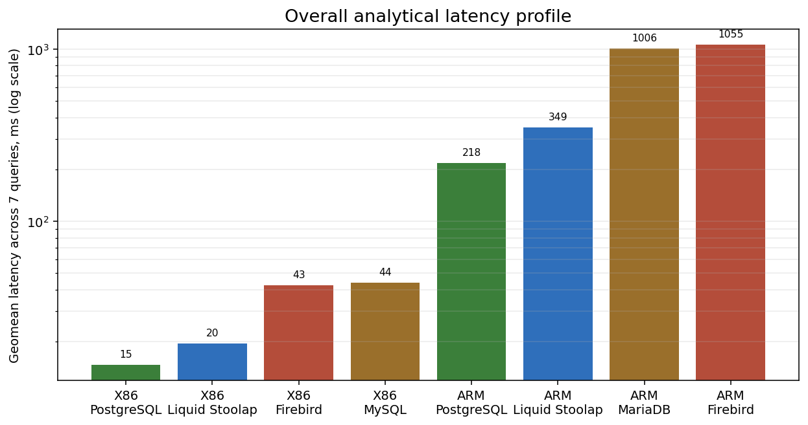
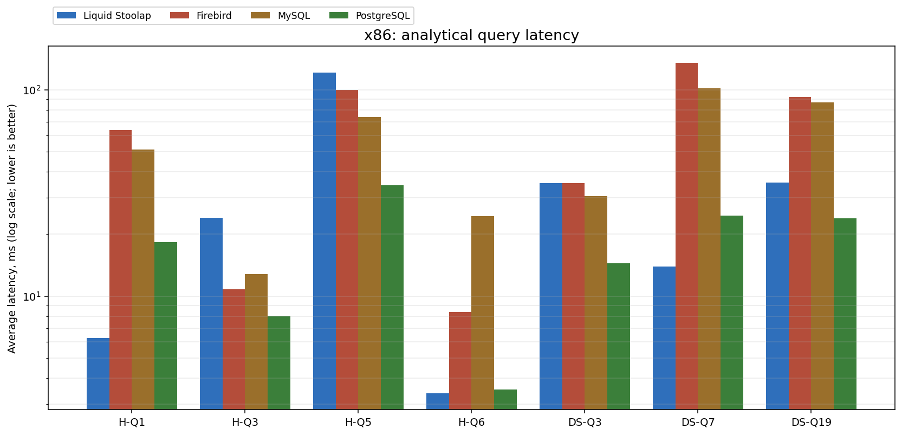
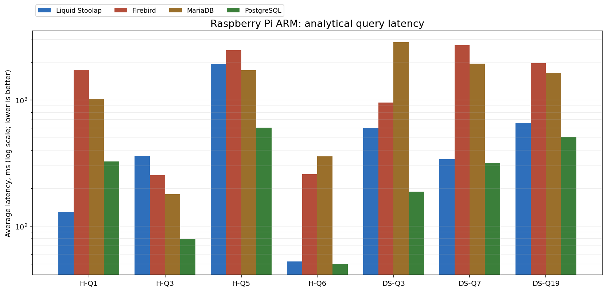
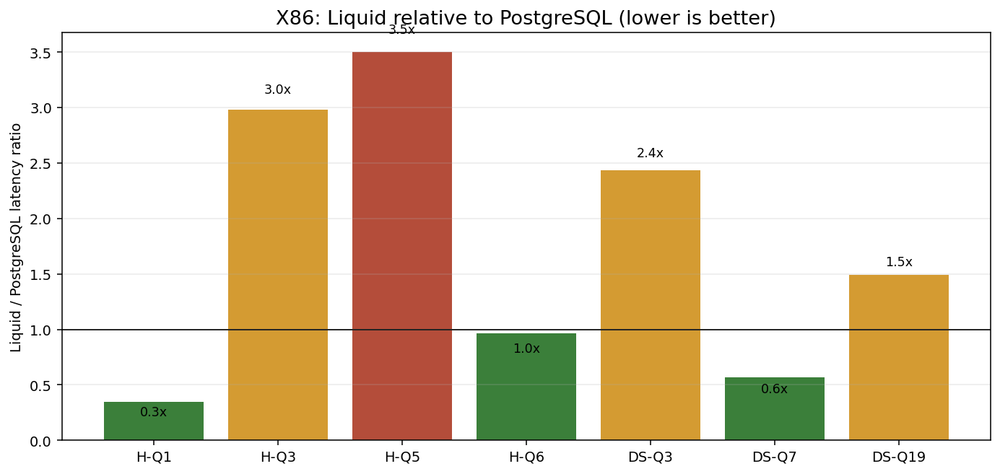
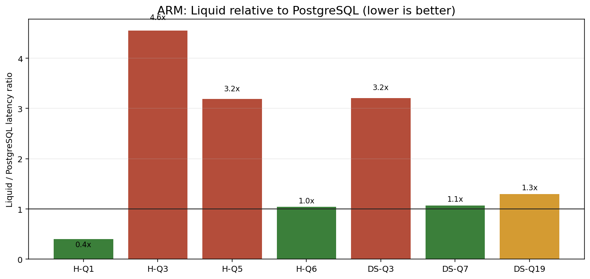

# Liquid Stoolap на x86 и Raspberry Pi: HTTP-обертка над embedded SQL против PostgreSQL, MySQL/MariaDB и Firebird

> Это не официальный TPC-бенчмарк. Ниже описаны TPC-H/TPC-DS-inspired нагрузки, написанные для инженерного сравнения в одном проекте. Цель была не получить сертифицированные цифры, а понять профиль Liquid Stoolap: где он силен, где слабее зрелых СУБД и в каких нишах его имеет смысл применять.

## Что тестировалось

Liquid Stoolap - это легкий HTTP-сервер для выполнения SQL поверх embedded-движка Stoolap. Серверная часть реализована на Free Pascal и загружает `libstoolap.so` через C FFI. Вокруг этого строится простой REST API, Python SDK и Node-RED connector.

Идея продукта не в том, чтобы заменить PostgreSQL как универсальную серверную СУБД. Liquid Stoolap занимает другой слой: локальный SQL-движок, доступный по HTTP из автоматизаций, скриптов, edge-устройств и self-hosted окружений.

Участники сравнения:

- Liquid Stoolap + Stoolap FFI.
- PostgreSQL.
- MySQL на x86, MariaDB на Raspberry Pi.
- Firebird.

## Методика

Бенчмарк запускался с клиентской машины и подключался к каждому серверу БД по TCP. Это важно: даже Liquid не вызывался локально через библиотеку, а проходил через HTTP API.

Сразу расшифрую обозначения. В результатах встречаются имена вроде `H-Q1` и `DS-Q7`. Это не версии продукта и не внутренние номера тестов Liquid. Это короткие имена запросов:

- `H` - запрос из набора TPC-H-like.
- `DS` - запрос из набора TPC-DS-like.
- `Q` - query, то есть SQL-запрос.
- число после `Q` - номер сценария, вдохновленного соответствующим запросом из семейства TPC.

Почему я пишу `TPC-H-like` и `TPC-DS-like`, а не просто TPC-H/TPC-DS? Потому что настоящий TPC-бенчмарк - это не только SQL-запросы. Это строгая спецификация генерации данных, scale factor, правил прогрева, подсчета метрик, конфигурации, аудита и публикации. Здесь был инженерный микробенчмарк, который использует похожие типы запросов и похожую бизнес-семантику, но не претендует на официальный TPC result.

Нагрузки:

- TPC-H-inspired: `H-Q1`, `H-Q3`, `H-Q5`, `H-Q6`.
- TPC-DS-inspired: `DS-Q3`, `DS-Q7`, `DS-Q19`.
- Scale = 1 в рамках нашего генератора данных.
- На каждый запрос выполнялся warm-up, затем 3 измеряемых повтора.
- В таблицах ниже указана средняя latency в миллисекундах, меньше - лучше.

Размеры synthetic dataset:

- TPC-H-like: `nation` 25 строк, `customer` 2 000, `orders_t` 12 000, `lineitem` 48 000.
- TPC-DS-like: `date_dim` 1 825, `item` 5 000, `customer_address` 10 000, `customer_ds` 10 000, `store_sales` 50 000.

TPC-C в финальное сравнение не вошел. Для текущей архитектуры Liquid Stoolap один HTTP-запрос соответствует одной единице SQL-исполнения, без stateful SQL-сессии между запросами. Поэтому transaction-mix вида TPC-C получался бы сравнением разных моделей, а не чистым сравнением движков.

## Что означает каждый запрос

Если упростить, TPC-H проверяет классическую аналитику по заказам: клиенты, заказы, строки заказов, страны, сегменты рынка. Это близко к отчетам вида "сколько продали", "какой сегмент принес выручку", "какие страны лидируют".

TPC-DS ближе к retail/data warehouse сценарию: продажи в магазинах, товары, даты, адреса покупателей. Там больше похоже на витрину данных интернет-магазина или сети магазинов.

В нашем наборе были такие запросы:

| Запрос | Что делает | Что в основном проверяет |
|---|---|---|
| `H-Q1` | Сканирует `lineitem`, фильтрует по дате отгрузки, группирует по флагам и считает `SUM`, `AVG`, `COUNT` | Быстрый scan, фильтрация, агрегация без join |
| `H-Q3` | Соединяет клиентов, заказы и строки заказов, фильтрует по market segment и датам, считает выручку, сортирует top-10 | Join нескольких таблиц, фильтры, aggregation + order by |
| `H-Q5` | Соединяет клиентов, заказы, строки заказов и страны, считает выручку по странам | Более тяжелый multi-table join и group by |
| `H-Q6` | Сканирует `lineitem`, фильтрует по дате, скидке и количеству, считает сумму | Селективный scan + простой агрегат |
| `DS-Q3` | Соединяет продажи, товары и даты, считает продажи по категориям и месяцам | Star-schema join, group by по измерениям |
| `DS-Q7` | Соединяет продажи и товары, считает средние quantity/price/profit по категориям и классам | Aggregation по товарным измерениям |
| `DS-Q19` | Соединяет продажи, покупателей и адреса, считает продажи и количество по штатам | Join + group by по клиентскому измерению |

То есть эти запросы не измеряют "одну абстрактную скорость базы". Они подсвечивают разные свойства движка:

- насколько быстро он читает много строк;
- насколько хорошо применяет фильтры;
- насколько эффективно строит join-планы;
- насколько дорогая сортировка и группировка;
- сколько overhead добавляет сетевой/HTTP слой;
- насколько движок стабилен на слабом ARM-устройстве.

Поэтому один участник может выиграть `H-Q1`, но проиграть `H-Q5`. Это нормально: первый запрос почти весь про scan + aggregate, второй - про optimizer и join execution.

## Как читать графики и таблицы

В таблицах указана средняя latency одного SQL-запроса в миллисекундах. Меньше - лучше. Например, `50 ms` значит, что после прогрева запрос в среднем возвращал результат примерно за одну двадцатую секунды, а `2000 ms` - около двух секунд.

На графиках latency по запросам используется логарифмическая шкала. Она нужна потому, что рядом встречаются значения от единиц миллисекунд до нескольких секунд. На обычной линейной шкале маленькие значения слиплись бы у нуля.

Отдельно есть график геометрического среднего. Геометрическое среднее удобно, когда сравниваются величины с большим разбросом: оно не дает одному очень медленному запросу полностью задавить остальные, но все равно показывает общий профиль движка. Это не "официальный score", а компактная сводка по семи аналитическим запросам.

## Стенды

### x86 стенд

Сервер: `x86 test host`.

Все данные размещались на одном разделе:

```text
/dev/sda2 mounted on /
```

Версии и способ запуска:

- Liquid Stoolap: Free Pascal server + Stoolap FFI.
- Firebird: container `ghcr.io/fdcastel/firebird:5.0.4-noble`.
- MySQL: container `mysql:8.4`.
- PostgreSQL: container `postgres:16`.

### ARM стенд

Raspberry Pi: `Raspberry Pi test host`, Raspbian 11 bullseye, ARMv7 hard-float, Cortex-A53, 4 cores, около 870 MiB RAM.

Все данные также были на одном разделе:

```text
/dev/root mounted on /
```

Версии и способ запуска:

- Liquid Stoolap: сервер Free Pascal собран на Pi; `libstoolap.so` собрана на Pi как ARMHF shared library.
- PostgreSQL 13 из системных пакетов.
- MariaDB 10.5 из системных пакетов.
- Firebird 3.0 из системных пакетов.

На Pi Docker не использовался. СУБД ставились системно на время эксперимента и после прогона удалялись.

## Графики

Общая картина по всем аналитическим запросам:



x86, latency по каждому запросу:



ARM/Raspberry Pi, latency по каждому запросу:



Liquid относительно PostgreSQL:





## Результаты x86

Средняя latency, ms:

| Engine | H-Q1 | H-Q3 | H-Q5 | H-Q6 | DS-Q3 | DS-Q7 | DS-Q19 |
|---|---:|---:|---:|---:|---:|---:|---:|
| Liquid Stoolap | 6.3 | 24.0 | 121.0 | 3.4 | 35.2 | 13.9 | 35.4 |
| Firebird | 63.8 | 10.8 | 99.7 | 8.4 | 35.3 | 135.1 | 92.3 |
| MySQL | 51.2 | 12.8 | 73.8 | 24.4 | 30.5 | 101.8 | 87.0 |
| PostgreSQL | 18.2 | 8.0 | 34.5 | 3.5 | 14.5 | 24.5 | 23.8 |

Геометрическое среднее по 7 аналитическим запросам:

| Engine | Geomean latency, ms |
|---|---:|
| PostgreSQL | 14.7 |
| Liquid Stoolap | 19.5 |
| Firebird | 42.6 |
| MySQL | 44.0 |

На x86 PostgreSQL ожидаемо выглядит самым ровным участником: он выигрывает большинство join-heavy запросов и дает лучший общий профиль. Liquid Stoolap при этом не выглядит игрушкой: он выигрывает `H-Q1` - scan и агрегацию большой таблицы строк заказов, почти равен PostgreSQL на `H-Q6` - селективном scan с простым агрегатом, выигрывает `DS-Q7` - агрегацию продаж по товарным категориям, и находится в том же порядке величины по остальным DS-запросам.

Главная слабость Liquid на x86 - `H-Q5`: многотабличный join с агрегацией выручки по странам, где PostgreSQL заметно впереди. Это хороший индикатор того, что optimizer/join execution у зрелой серверной СУБД пока сильнее. Но для маленького embedded-движка, доступного через HTTP, результат все равно практически интересный: большая часть запросов не проваливается на порядок.

## Результаты Raspberry Pi / ARM

Средняя latency, ms:

| Engine | H-Q1 | H-Q3 | H-Q5 | H-Q6 | DS-Q3 | DS-Q7 | DS-Q19 |
|---|---:|---:|---:|---:|---:|---:|---:|
| Liquid Stoolap | 129.3 | 361.1 | 1930.0 | 52.5 | 601.2 | 339.5 | 657.8 |
| Firebird | 1729.5 | 254.0 | 2488.7 | 258.9 | 957.7 | 2730.6 | 1961.3 |
| MariaDB | 1021.4 | 179.6 | 1728.0 | 357.7 | 2877.3 | 1945.6 | 1644.2 |
| PostgreSQL | 325.7 | 79.3 | 605.1 | 50.2 | 187.3 | 316.7 | 507.4 |

Геометрическое среднее по 7 аналитическим запросам:

| Engine | Geomean latency, ms |
|---|---:|
| PostgreSQL | 218.3 |
| Liquid Stoolap | 349.4 |
| MariaDB | 1006.1 |
| Firebird | 1054.7 |

На Raspberry Pi PostgreSQL снова первый по общему профилю. Это особенно заметно на `H-Q3` - join клиентов, заказов и строк заказов с top-10 по выручке, `H-Q5` - join четырех таблиц с группировкой по странам, и `DS-Q3` - star-schema join продаж, товаров и календаря. В таких задачах зрелый optimizer и execution engine решают.

Но ARM-результаты Liquid интереснее, чем просто "PostgreSQL быстрее". Liquid выигрывает у PostgreSQL на `H-Q1`, то есть на scan + aggregate без join, почти равен на `H-Q6`, где нужен селективный scan с суммированием, близок на `DS-Q7`, где группируются продажи по товарным категориям. По общему профилю Liquid значительно лучше MariaDB и Firebird в этой конкретной постановке. Для edge-устройства с 870 MiB RAM это важный сигнал: Liquid Stoolap не только запускается на Pi, но и способен выполнять небольшую аналитику с приемлемой latency.

## Что в Liquid Stoolap получилось хорошо

### 1. Низкая операционная сложность

Liquid Stoolap - один серверный бинарник Free Pascal плюс `libstoolap.so`. Нет отдельного server daemon у embedded-движка, нет системного кластера, нет обязательного Docker, нет сложной инициализации СУБД.

Для edge и home-lab сценариев это часто важнее абсолютной победы в каждом запросе. Устройство может быть слабым, сеть - локальной, администрирование - эпизодическим. В такой среде "запустил HTTP endpoint и пишу SQL" имеет ценность.

### 2. Хороший профиль для scan/aggregate задач

Liquid хорошо показал себя на запросах типа:

- `H-Q1`: фильтрация, группировка, несколько агрегатов.
- `H-Q6`: селективная фильтрация и агрегат.
- `DS-Q7`: группировка продаж по категориям.

На x86 Liquid оказался быстрее PostgreSQL на `H-Q1` и `DS-Q7`, а на ARM почти сравнялся с PostgreSQL на `H-Q6` и был близок на `DS-Q7`.

Это говорит о нише "маленькая локальная аналитика": телеметрия, события автоматизации, локальные counters, агрегирование данных с датчиков, быстрые SQL-отчеты поверх embedded-хранилища.

### 3. Предсказуемый HTTP-контракт

Сервер возвращает JSON result set с `columns`, `types` и `rows`. Это менее "магично", чем ORM, но удобно для интеграций:

- Python-скрипты.
- Node-RED flows.
- локальные сервисы автоматизации.
- CLI и cron-задачи.

Для проекта, ориентированного на automation, такой формат важен. Клиенту не нужно подключать native driver или тащить серверную СУБД в каждую среду.

### 4. ARM жизнеспособен

Самый неприятный практический момент был не runtime, а сборка Rust-библиотеки Stoolap на Raspberry Pi. Release-сборка заняла около 79 минут даже после отключения LTO. После этого готовый ARMHF-артефакт имеет нормальный размер и запускается.

Практический вывод: для Raspberry Pi лучше поставлять prebuilt `libstoolap.so`. Runtime-поведение уже интересное, а вот заставлять пользователя компилировать это на устройстве - плохой UX.

## Где Liquid Stoolap пока слабее

### 1. Join-heavy аналитика

Запросы `H-Q3` и особенно `H-Q5` показывают, что PostgreSQL пока сильнее в сложных join-планах. Это не просто "два медленных номера". `H-Q3` строит top-10 заказов по выручке после соединения трех таблиц, а `H-Q5` считает выручку по странам через цепочку из четырех таблиц. На ARM разрыв особенно заметен:

- `H-Q5`: Liquid 1930 ms против PostgreSQL 605 ms.
- `H-Q3`: Liquid 361 ms против PostgreSQL 79 ms.

Если задача - тяжелая многотабличная аналитика, ad-hoc BI и сложная оптимизация запросов, PostgreSQL остается более рациональным выбором.

### 2. Это не замена серверной транзакционной СУБД

Liquid v1 по архитектуре intentionally stateless: один HTTP request - одна единица SQL-исполнения. Многозапросные транзакции через stateful server sessions не являются целью v1. Поэтому сравнивать его с PostgreSQL в OLTP-сценариях нужно очень аккуратно.

Хорошая формулировка: Liquid Stoolap - это SQL endpoint для embedded-хранилища, а не distributed transactional database server.

### 3. Версии конкурентов на ARM не равны x86

На x86 использовались контейнеры с более свежими версиями: PostgreSQL 16, MySQL 8.4, Firebird 5. На Pi использовались системные пакеты Raspbian 11: PostgreSQL 13, MariaDB 10.5, Firebird 3.0.

Поэтому x86 и ARM нельзя читать как "одинаковые СУБД на разных CPU". Это скорее два практических сценария:

- современный x86 lab/server;
- реально доступный Raspberry Pi без Docker и без ручной сборки всех СУБД из исходников.

## Ниши Liquid Stoolap

### Edge analytics

Raspberry Pi, промышленные gateway, локальные контроллеры, небольшие ARM box. Данные пишутся и читаются локально, а наружу торчит маленький HTTP API. Это удобнее, чем поднимать полноценный PostgreSQL там, где он избыточен.

Примеры:

- локальная история показаний датчиков;
- буферизация событий на краю сети;
- простые SQL-агрегаты перед отправкой в центральную систему;
- локальная диагностика устройства.

### Home automation и Node-RED

Node-RED любит HTTP и JSON. Liquid Stoolap хорошо ложится в эту модель: SQL node отправляет запрос, получает структурированный result set, дальше flow может принимать решения.

Здесь особенно важны:

- простота установки;
- предсказуемый API;
- отсутствие тяжелого администрирования;
- локальное хранение без внешней зависимости.

### Self-hosted utility database

Есть класс задач, где SQLite слишком локален, PostgreSQL слишком тяжел, а хочется "маленький SQL по HTTP":

- персональные dashboards;
- cron-скрипты;
- локальные ETL-задачи;
- небольшой metadata store;
- внутренние инструменты в домашней или лабораторной сети.

Liquid Stoolap может занять эту промежуточную нишу.

### Встраиваемый аналитический endpoint для приложений

Если приложению нужен локальный SQL-движок, но клиенты должны обращаться по HTTP, Liquid дает готовую форму: auth, JSON, health check, CLI, SDK. Это снижает количество инфраструктурного кода вокруг embedded database.

## Что стоит улучшать дальше

По результатам бенчмарка видны понятные инженерные направления:

1. Оптимизация join-heavy запросов в Stoolap: top-10 выручки по заказам (`H-Q3`) и выручка по странам через несколько join (`H-Q5`).
2. Предсобранные ARMHF/ARM64 артефакты, чтобы не компилировать `libstoolap.so` на Raspberry Pi.
3. Bulk load endpoint или оптимизированный insert path через HTTP, чтобы setup больших наборов данных не был узким местом.
4. Больше observability: per-query timings на стороне сервера, разбивка parse/execute/serialize.
5. Отдельный benchmark для write-heavy сценариев, но не выдавать его за TPC-C, пока модель транзакций HTTP API не совпадает с моделью серверных СУБД.

## Вывод

PostgreSQL ожидаемо остается лучшим универсальным выбором для сложной аналитики и серверных workload. Это не сюрприз и не поражение Liquid Stoolap.

Интересный результат в другом: Liquid Stoolap оказался достаточно быстрым, чтобы быть практичным SQL-over-HTTP endpoint для небольших аналитических и automation-нагрузок. На x86 он близок к PostgreSQL по общему аналитическому профилю и выигрывает отдельные scan/aggregate запросы. На Raspberry Pi он уступает PostgreSQL в сложных join-heavy запросах, но выглядит значительно лучше MariaDB и Firebird в этой конкретной постановке и остается пригодным для edge-сценариев.

Ниша Liquid Stoolap - не "убийца PostgreSQL". Его ниша - легкий, локальный, предсказуемый SQL endpoint для embedded данных: home automation, Node-RED, edge analytics, self-hosted утилиты и приложения, которым нужен SQL без полноценной серверной СУБД.

## Где лежат сырые результаты

- x86: `benchmarks/network_tpc_results_scale1.json`
- Raspberry Pi / ARM: `benchmarks/pi_tpc_results_scale1.json`
- Pi runner: `benchmarks/pi_tpc_suite.py`
- Графики: `docs/articles/assets/`
